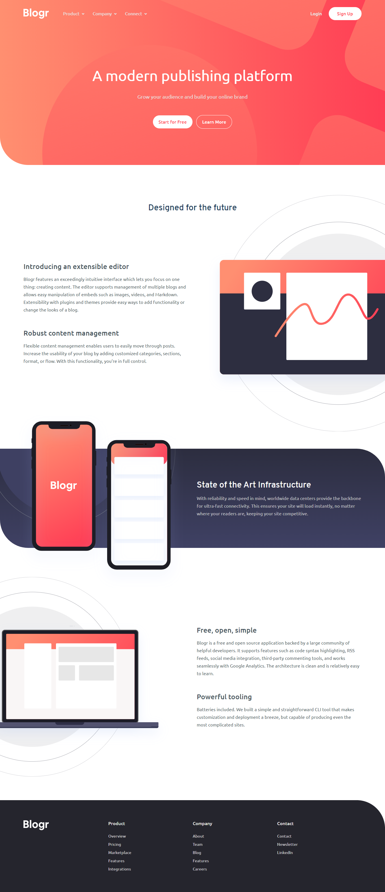
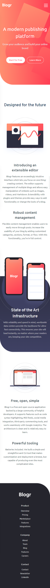

# Frontend Mentor - Blogr landing page solution

This is a solution to the [Blogr landing page challenge on Frontend Mentor](https://www.frontendmentor.io/challenges/blogr-landing-page-EX2RLAApP). Frontend Mentor challenges help you improve your coding skills by building realistic projects.

## Table of contents

-  [Overview](#overview)
   -  [The challenge](#the-challenge)
   -  [Screenshot](#screenshot)
   -  [Links](#links)
-  [Built with](#built-with)
-  [Author](#author)

## Overview

### The challenge

Users should be able to:

-  View the optimal layout for the site depending on their device's screen size
-  See hover states for all interactive elements on the page

### Screenshot

   Desktop
     
  

   Mobile
     
  

### Links

-  Solution URL: [Jump to solution](https://www.frontendmentor.io/solutions/responsive-blogr-landing-page-using-flexbox-and-css-grid-t5RNXDZB1)
-  Live Site URL: [https://romantic-panini-e82ee9.netlify.app](https://romantic-panini-e82ee9.netlify.app/)

### Built with

-  Semantic HTML5 markup
-  CSS custom properties
-  Flexbox
-  CSS Grid
-  JavaScript
-  Desktop-first workflow

## Author

-  Facebook - [Indra Adi Kusuma](https://www.your-site.com)
-  Instagram - [@mrx.indra](https://www.your-site.com)
-  LinkedIn - [Indra Adi Kusuma](https://www.linkedin.com/in/indra-adi-kusuma-a37955173)
-  Frontend Mentor - [@indraAK](https://www.frontendmentor.io/profile/indraAK)
